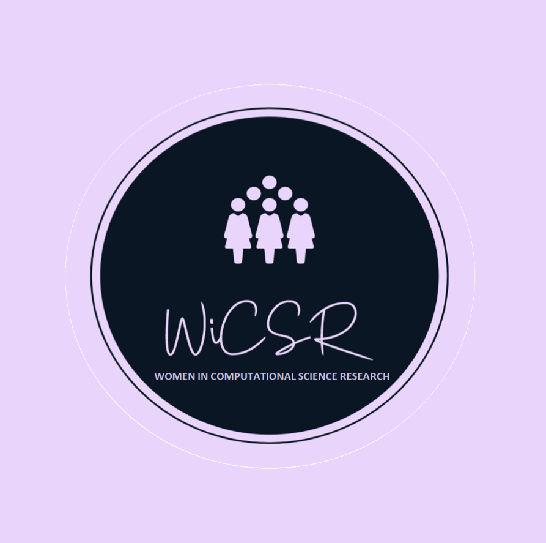

***“You can’t be what you can’t see
In each of us, another woman or a young girl might see a reflection of herself;
Of her worth, of her boundless potential.
The youth need to see their greatness reflected in our eyes.
Go forth. Let them know we are real.”*** ~ **HΘMΣCΘMING**

  

## Proposal
We aim to create a community which empowers and encourages the growth and participation of women in the field of computational science research. This community is for minorities within the field of computational science research which includes but not limited to: computer science, machine learning, data science/mining, robotics, AI and any other related field. To foster this we propose launching the community with a full day event in which we will:
 

1. **Highlight various research areas:** We will invite various female speakers doing exciting research in Computational Science. We will also highlight funding opportunities and application processes(e.g. What is expected/tips in the NRF/CSIR funding application ), and discuss both national and international conferences to showcase their work at (Conference information is not always intuitive). We will have an interactive session where various potential supervisors and research based companies will get an opportunity to express their research interests and elaborate more on what their fields entail in a one to many kind of speed dating fashion. 
 

2. **Highlight labs or various research groups at different universities:** We would like to publicize potential supervisors and their respective labs/research groups. Who they are, what they focus on, if their presentations or talks are open to students in their universities outside their labs, what they fund as a lab/research group and the equipment/resources they have as a lab/research group. This is so that women can have the freedom of absolute choice on what is globally available and not have the limit of supervisors/labs/research groups within their social circles.
 

3. **Form a community:** This community will mainly be for women to get to know each other in this space so that they can also know who does what, who is good at what for academic assistance and also to foster academic collaborations or reading groups. Most importantly this community will serve as a platform for women to be comfortable enough with each other to discuss and address issues that are discouraging women to pursue research as a career. For example address social issues such as harassment in the workspace (e.g. labs/classrooms). The main goal is to locally(within individual schools) make the environment of doing research more comfortable and conducive for women to excel in this field.
 

4. **Have a panel discussion:** Lastly, we would like to close the event with a panel discussion on a topic which is interesting to the community.
  

More long term we would also like to push for workshops to be hosted throughout the year by experts (lecturers/supervisors/people more knowledgeable with the topic) on things like python, tensorflow, pytorch, how to write a good research paper or even how to run jobs on a cluster. All depending on popular demand. Aslo In future events we may also facilitate mentorship programmes for more consistent interactions.
 

It can be a very lonely environment for a woman in this male dominated field which is one of the reasons why it can be easy to undermine the idea of pursuing a research career or even postgraduate research studies. We hope by creating this community and making information more accessible, we will encourage and empower more women to pursue postgraduate studies or start a research based career in the field of computational science research.

